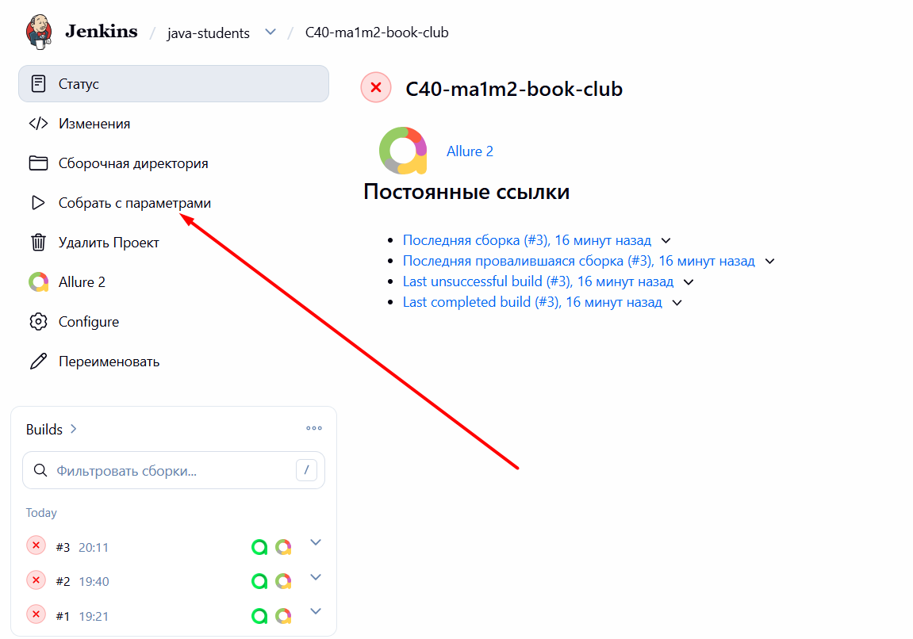
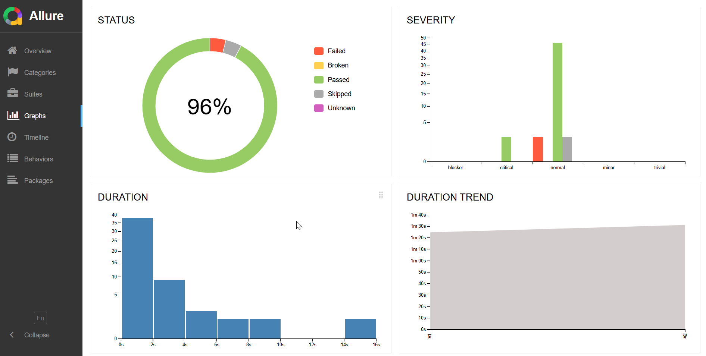
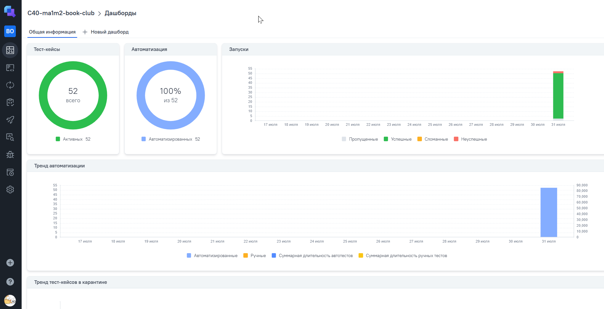
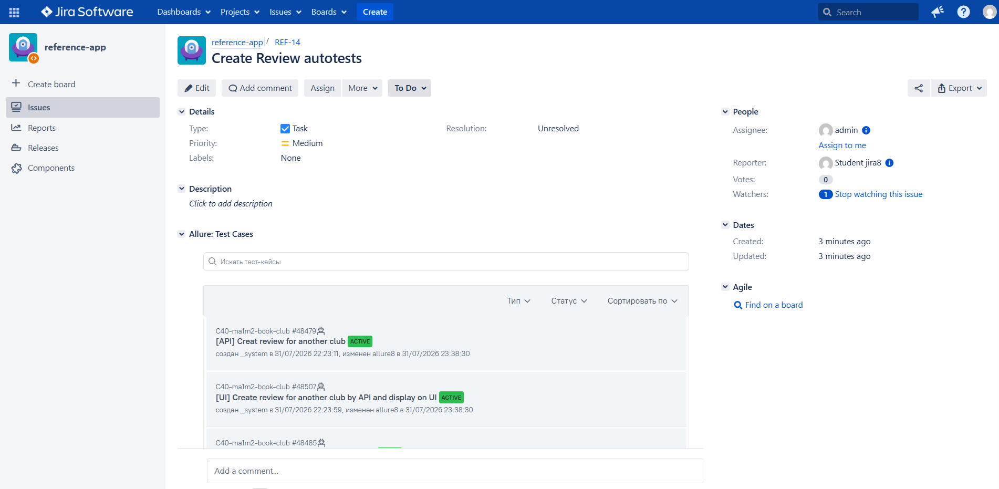
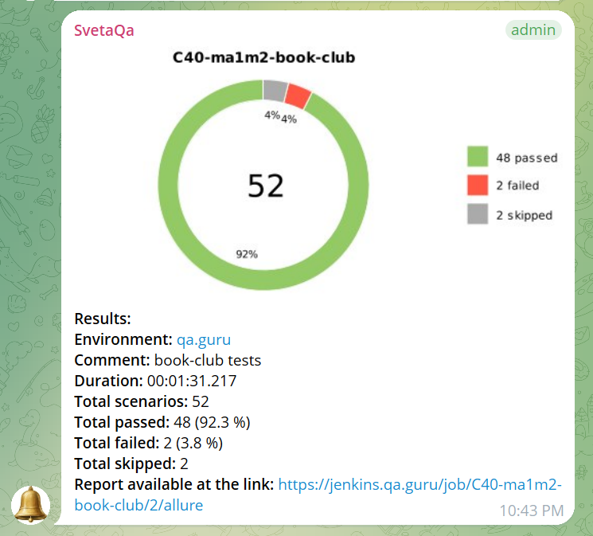

[Launch details in Docker](RUN_INFO.md)
# [Book Club](https://book-club.qa.guru/) Web App — API + UI Test Automation Demo

> This is a demo project with automated tests for the Book Club web application, covering both REST API and UI layers.

## Contents:
____
* <a href="#tools">Technologies & Tools</a>

* <a href="#cases">Automated Test Scenarios</a>

* <a href="#project-structure">Project Structure</a>

* <a href="#jenkins">Jenkins Build</a>

* <a href="#console">Running Tests (Terminal)</a>

* <a href="#allure">Allure Report</a>

* <a href="#allure-testops">Allure TestOps Integration</a>

* <a href="#jira">Jira Integration</a>

* <a href="#tg">Telegram Alerts</a>

* <a href="#video">Video Example</a>
____
<a id="tools"></a>
## Technologies & Tools

<p align="center">  
<a href="https://www.jetbrains.com/idea/"></a>  
<a href="https://www.java.com/"></a>  
<a href="https://github.com/"></a>  
<a href="https://junit.org/junit5/"></a>  
<a href="https://gradle.org/"></a>
<a href="https://www.selenium.dev/"></a>  
<a href="https://selenide.org/"></a>  
<a href="https://aerokube.com/selenoid/"></a> 
<a href="https://rest-assured.io/"></a>
<a href="https://github.com/allure-framework/allure2"></a> 
<a href="https://qameta.io/"></a>
<a href="https://www.jenkins.io/"></a>  
<a href="https://www.atlassian.com/ru/software/jira/"></a>  
</p>


- Programming language: [Java](https://www.java.com/ru/)
- API automation: [Rest Assured](https://rest-assured.io/)
- UI automation: [Selenide](https://selenide.org/)
- Test framework: [JUnit5](https://github.com/junit-team/junit5)
- Build system: [Gradle](https://gradle.org/)
- CI/CD: [Jenkins](https://www.jenkins.io/)
- Reporting: [Allure](https://github.com/allure-framework)
- Test run notifications: Telegram-bot
- Integration with  [Allure TestOps](https://qameta.io/)
- Integration with  [Jira Software](https://www.atlassian.com/software/jira)
___

<a id="#cases"></a>
## Automated Test Scenarios
____
- ✓ * *
- ✓ * *
- ✓ * *
- ✓ * *
- ✓ * *
- ✓ * *
- ✓ * *
____
<a id="project-structure"></a>
## 📁 Project Structure

```text
src/test/java/msl/qa/
├── allure/
│   ├── Attach.java     # вложения для Allure Report (скриншот, видео, логи)
│   └── Manual.java     # аннотация для Мануальных тестов
├── config/
│   ├── WebConfig.java  # настройки (ключи, url)
├── page/
│   ├── BasePage.java       # базовая страница
│   ├── EducationPage.java  # page object для сля страницы Образование
│   ├── HomePage.java       # page object для главной страницы
│   └── component/
│       ├── FooterComponent.java # футор
│       └── MainMenu.java        # главное меню
└── tests/
    ├── HomeTests.java        # тесты для главной страницы
    ├── SearchTests.java      # тесты для поисковой строки на EducationPage
    ├── SocialLinksTests.java # тесты на ссылки для социальных сетей
    ├── SwitchTests.java      # тесты на открытие страницы в новой вкладке браузера
    ├── TestBase.java         # с методами @BeforeAll, @BeforeEach, @AfterEach
    └── TestData.java         # статические тестовые данные для проверки строк на сайте
        
src/test/resources/
└── config/
    ├── local.properties   # файл конфигурации для локального запуска
    └── remote.properties  # файл конфигурации для удаленного запуска
```
----
<a id="jenkins"></a>
##  </a> Jenkins Build <a target="_blank" href="https://jenkins.qa.guru/job/C40-ma1m2-redsoft/"></a>
To access Jenkins, registration on the resource is required [Jenkins](https://jenkins.qa.guru/).
To start the build, click the <code>Build Now</code> button.
____
<p align="center">  
<a href="https://jenkins.qa.guru/view/java-students/job/C40-ma1m2-book-club/" target="_blank" rel="noopener noreferrer"></a>  
</p>

### **Build Parameters in Jenkins:**

- *browser (default is chrome)*
- *browserVersion (browser version, default is an empty string = latest version)*
- *browserSize (browser window size, default is 1366x768)*
- *env (configuration file, default is local)*


<a id="console"></a>
## Running Tests (Terminal)
___
***Local run:***
```bash  
./gradlew clean test -Denv=local
```
***Docker run:***
```bash  
./gradlew clean test -Denv=docker
```
***Remote run in Selenoid:***
```bash  
./gradlew clean test -Denv=remote
```
___
<a id="allure"></a>
## </a> <a name="Allure"></a>Allure [Report](https://jenkins.qa.guru/view/java-students/job/C40-ma1m2-book-club/3/allure-report/)</a>
___

### Overview page of Allure Report

<p align="center">  
  
</p>  

### Test-cases

<p align="center">  
  
</p>

### Graphs

  <p align="center">  

</p>

___
<a id="allure-testops"></a>
## </a> Integration with <a target="_blank" href="https://allure.autotests.cloud/project/5304/launches">Allure TestOps</a>
Allure TestOps is a full-stack test management platform that unites automated and manual testing in one workspace.
____
### *Allure TestOps Dashboard*

<p align="center">  
  
</p>  

### Auto and Manual Test-cases

<p align="center">  
  
</p>

___
<a id="jira"></a>
## </a> Integration with <a target="_blank" href="https://jira.qa.guru/browse/REF-14">Jira</a>
____
<p align="center">  
  
</p>

____
<a id="tg"></a>

## Telegram notifications:

Upon completion of each test run, a <code>Telegram bot</code> automatically processes the test run results and sends a report to a dedicated chat

____  
<p align="center">  
  
</p>

____  

<a id="video"></a>
## Video Example in Selenoid:
The Allure report attaches a screenshot from the final step and a video of the entire test run to each test case.
<p align="center">
  
</p>

